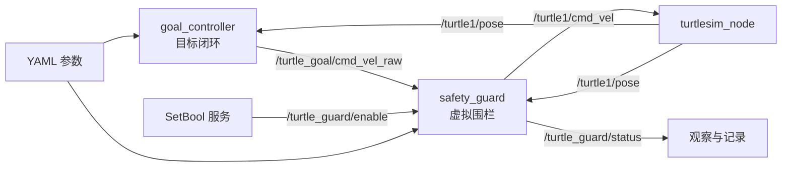

# 第7章案例：TurtleGuard——虚拟围栏与安全避界

本案例在第6章 `TurtleGoal` 的闭环控制基础上增加独立安全层。目标控制器只负责生成期望速度，安全守卫根据当前位置、围栏参数和原始速度，决定正常通行、比例减速、危险恢复或安全停车。

## 1. 学习目标与知识边界

完成案例后，学生应能够：

- 使用 ROS 2 参数描述可调安全规则，并用 YAML 保存配置；
- 将“任务控制”和“安全约束”拆分为职责单一的节点；
- 订阅位姿与原始速度，发布经过约束的安全速度；
- 使用标准 `SetBool` 服务启用或停用安全守卫；
- 处理参数非法、消息缺失和指令超时等异常；
- 通过话题、日志和参数命令收集运行证据。

本案例不使用 Action、正式状态机、自定义服务或多线程执行器。Launch 文件将在后续章节学习，本章使用多个终端启动节点。

## 2. 系统结构



两个速度话题必须分开。若目标控制器直接发布 `/turtle1/cmd_vel`，就可能绕过安全守卫。

## 3. 安全规则

设海龟到四条边界的最小距离为 `d`：

```text
d = min(x-world_min, world_max-x, y-world_min, world_max-y)
```

| 条件 | 模式 | 处理规则 |
|---|---|---|
| `d > warning_margin` | NORMAL | 限幅后通过 |
| `safe_margin < d <= warning_margin` | WARNING | 线速度按距离比例降低 |
| `d <= safe_margin` | DANGER | 放弃原始速度，转向中心并低速恢复 |
| 原始速度超时 | COMMAND_TIMEOUT | 发布零速度 |
| 安全守卫停用 | DISABLED | 仅保留速度限幅，不执行围栏规则 |

关键参数位于 `turtle_guard/config/turtle_guard.yaml`。默认目标 `(9.5, 5.5)` 会让海龟进入警告区，并在不进入危险区的情况下逐渐接近目标。

## 4. 构建

环境：Ubuntu 22.04、ROS 2 Humble、Python 3、turtlesim。

```bash
mkdir -p ~/turtle_guard_ws/src
cp -r turtle_guard ~/turtle_guard_ws/src/
cd ~/turtle_guard_ws
source /opt/ros/humble/setup.bash
colcon build --symlink-install
source install/setup.bash
```

## 5. 运行

以下命令分别在四个终端中执行。每个新终端都要加载 ROS 2 和工作空间环境。

终端1：

```bash
source /opt/ros/humble/setup.bash
source ~/turtle_guard_ws/install/setup.bash
ros2 run turtlesim turtlesim_node
```

终端2：

```bash
source /opt/ros/humble/setup.bash
source ~/turtle_guard_ws/install/setup.bash
ros2 run turtle_guard goal_controller --ros-args \
  --params-file ~/turtle_guard_ws/src/turtle_guard/config/turtle_guard.yaml
```

终端3：

```bash
source /opt/ros/humble/setup.bash
source ~/turtle_guard_ws/install/setup.bash
ros2 run turtle_guard safety_guard --ros-args \
  --params-file ~/turtle_guard_ws/src/turtle_guard/config/turtle_guard.yaml
```

终端4观察安全模式：

```bash
source /opt/ros/humble/setup.bash
source ~/turtle_guard_ws/install/setup.bash
ros2 topic echo /turtle_guard/status
```

## 6. 课堂实验

### 实验A：观察三级安全规则

记录海龟由 NORMAL 进入 WARNING 时的边界距离和线速度：

```bash
ros2 topic echo /turtle_guard/status
ros2 topic echo /turtle_goal/cmd_vel_raw
ros2 topic echo /turtle1/cmd_vel
```

比较原始速度和安全速度，解释 WARNING 模式中的比例减速。

### 实验B：触发危险恢复

把目标设到安全边界以内：

```bash
ros2 param set /turtle_goal_controller target_x 10.3
ros2 param set /turtle_goal_controller target_y 5.5
```

预期现象：安全状态进入 DANGER；海龟停止继续靠近边界，转向场地中心并低速恢复。目标控制器仍试图驶向目标，因此可能出现反复尝试与安全干预，这是两个节点规则冲突的可观察结果，而不是程序崩溃。

### 实验C：使用服务开关安全层

```bash
ros2 service call /turtle_guard/enable std_srvs/srv/SetBool "{data: false}"
ros2 service call /turtle_guard/enable std_srvs/srv/SetBool "{data: true}"
```

停用后状态为 DISABLED。为避免海龟撞到窗口边界，只进行短时间对比，并立即重新启用。

### 实验D：验证参数约束

```bash
ros2 param set /safety_guard safe_margin 2.5
```

默认 `warning_margin=2.0`，因此该修改应被拒绝。随后按合法顺序调整：

```bash
ros2 param set /safety_guard warning_margin 3.0
ros2 param set /safety_guard safe_margin 2.5
```

学生应记录命令返回值，并说明为何参数间约束比只检查单个参数更重要。

### 实验E：验证指令超时

保持安全守卫运行，按 `Ctrl+C` 停止目标控制器。超过 `command_timeout` 后，状态应变为 COMMAND_TIMEOUT，输出速度应为零。

## 7. 验收要求

- 能由 YAML 启动两个教学节点；
- `/turtle_guard/status` 能显示 NORMAL、WARNING 和 DANGER；
- WARNING 时安全线速度小于原始线速度；
- DANGER 时海龟不会继续驶向边界；
- 服务能够切换 `enabled` 参数；
- 非法参数被拒绝，原配置仍保持有效；
- 目标控制器停止后，安全守卫能在超时时间内停车。

建议提交：参数文件、关键命令、三种安全模式的日志、原始/安全速度对比记录，以及对节点职责划分的简短说明。

## 8. 文件说明

```text
turtle_guard/
├── config/turtle_guard.yaml
├── resource/turtle_guard
├── turtle_guard/
│   ├── __init__.py
│   ├── goal_controller.py
│   └── safety_guard.py
├── package.xml
├── setup.cfg
└── setup.py
```

本示例采用 Apache-2.0 许可证。当前仓库只完成静态检查；应在 Ubuntu 22.04 + ROS 2 Humble 环境中完成构建和运行验收。
