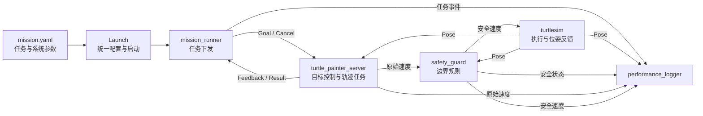

# 第9章案例：TurtleMission——参数化自主任务系统

TurtleMission是第一册贯穿案例的第四个，也是最后一个功能版本。它不新增另一套控制算法，而是集成第6章TurtleGoal、第7章TurtleGuard和第8章TurtlePainter，解决“多个节点如何配置、启动、记录、诊断和复现”的系统问题。

## 1. 本章新增能力

- 从YAML加载任务与系统参数；
- 使用Launch统一启动和监控多个节点；
- 使用命名空间（Namespace）隔离一套任务系统；
- 使用重映射（Remapping）把已有绝对接口接入命名空间；
- 自动下发Action Goal，并记录反馈、取消和结果事件；
- 同步记录位姿、安全模式、限制前后速度和任务事件；
- 可选使用rosbag2记录全部Topic；
- 使用ROS计算图和命令行工具定位集成故障。

本章没有引入多乌龟、TF、导航、正式状态机或真实机器人，也没有创建第五个案例。

## 2. 系统闭环



默认接口位于`/mission`命名空间，例如：

```text
/mission/turtle1/pose
/mission/turtle1/cmd_vel
/mission/turtle_goal/cmd_vel_raw
/mission/turtle_guard/status
/mission/turtle_painter/draw_shape
/mission/mission/status
```

## 3. 节点职责

| 节点 | 来源 | 职责 |
|---|---|---|
| `simulator` | turtlesim | 执行速度并反馈位姿 |
| `safety_guard` | 第7章 | 边界监测、速度约束和超时停车 |
| `turtle_painter_server` | 第8章 | 接收Action并完成目标到达和轨迹绘制 |
| `mission_runner` | 第9章 | 读取任务参数、发送Goal、记录Feedback和Result |
| `performance_logger` | 第9章 | 生成轨迹CSV和运行摘要JSON |

`mission_runner`完成后会退出，其余节点继续运行，便于检查结果。按`Ctrl+C`结束Launch时，性能记录器关闭CSV并生成摘要文件。

## 4. 工作空间与构建

适用环境：Ubuntu 22.04、ROS 2 Humble、Python 3、turtlesim。代码状态：静态审查；尚待ROS 2 Humble实际构建和运行验证。

将三个递进包放进同一工作空间：

```bash
mkdir -p ~/turtle_mission_ws/src
cp -r turtle_guard ~/turtle_mission_ws/src/
cp -r turtle_painter ~/turtle_mission_ws/src/
cp -r turtle_mission ~/turtle_mission_ws/src/
cd ~/turtle_mission_ws
source /opt/ros/humble/setup.bash
colcon build --symlink-install
source install/setup.bash
```

检查包和Launch文件：

```bash
ros2 pkg executables turtle_mission
ros2 launch turtle_mission turtle_mission.launch.py --show-args
```

预期结果：能看到`mission_runner`、`performance_logger`，以及`namespace`、`auto_start`、`record_bag`和`bag_name`四个Launch参数。

若`turtle_painter/action/DrawShape`不存在，应先检查第8章接口包是否构建成功，而不是修改第9章Python代码。

## 5. 一条命令启动完整任务

ROS2实现，Ubuntu 22.04，ROS 2 Humble：

```bash
source /opt/ros/humble/setup.bash
source ~/turtle_mission_ws/install/setup.bash
ros2 launch turtle_mission turtle_mission.launch.py
```

默认过程：

1. 启动turtlesim、安全守卫、绘图服务器和性能记录器；
2. 等待2秒；
3. `mission_runner`读取`config/mission.yaml`；
4. 下发正方形绘制任务；
5. 发布JSON格式任务事件；
6. 输出轨迹CSV；
7. 结束Launch时生成JSON摘要。

运行文件默认写入：

```text
~/.ros/turtle_mission/YYYYMMDD_HHMMSS_trajectory.csv
~/.ros/turtle_mission/YYYYMMDD_HHMMSS_summary.json
```

## 6. YAML任务配置

修改源码目录中的：

```text
turtle_mission/config/mission.yaml
```

然后使用`--symlink-install`工作空间重新启动。示例任务参数：

```yaml
mission_runner:
  ros__parameters:
    mission_id: mission_triangle_01
    shape_name: triangle
    size: 2.5
    start_x: 4.0
    start_y: 4.0
    speed: 1.0
    cancel_after: 0.0
```

`cancel_after`为0表示不自动取消；大于0表示Goal接受后经过指定秒数发出取消请求。YAML不仅包含任务目标，还统一管理控制、安全和记录参数。

## 7. Namespace与Remapping实验

使用另一个命名空间启动：

```bash
ros2 launch turtle_mission turtle_mission.launch.py \
  namespace:=course_demo
```

检查节点和Topic：

```bash
ros2 node list
ros2 topic list | grep course_demo
ros2 node info /course_demo/safety_guard
```

预期结果：系统接口由`/mission/...`变成`/course_demo/...`。Launch文件将第7、8章代码使用的绝对名称重映射为相对名称，再由命名空间形成完整名称。

故障注入：从Launch文件中暂时移除Painter的`/turtle1/pose`重映射。预期现象是Action Server收不到命名空间中的位姿并中止任务。诊断路径：

```bash
ros2 node info /course_demo/turtle_painter_server
ros2 topic info /course_demo/turtle1/pose -v
```

比较Publisher和Subscriber实际使用的Topic名称，恢复重映射后复测。

## 8. 运行记录与rosbag2

### 8.1 自动记录CSV和JSON

CSV每个采样周期记录：

- 位姿`x`、`y`、`theta`；
- TurtleGuard安全模式；
- 限制前后的线速度和角速度；
- 最近一次任务事件。

摘要JSON记录持续时间、采样数、最终任务事件、安全模式和CSV路径。它是轻量评价材料，不替代rosbag。

### 8.2 Launch自动启动rosbag

```bash
ros2 launch turtle_mission turtle_mission.launch.py \
  record_bag:=true bag_name:=mission_square_01_bag
```

该选项执行`ros2 bag record -a`。输出目录已存在时rosbag会拒绝覆盖，应更换`bag_name`，不要删除已有证据。

检查记录：

```bash
ros2 bag info mission_square_01_bag
```

回放前先停止原系统，再启动不自动下发任务的系统：

```bash
ros2 launch turtle_mission turtle_mission.launch.py auto_start:=false
ros2 bag play mission_square_01_bag
```

回放全部系统Topic可能重新发布速度和事件，教学中应先查看`ros2 bag info`，再决定回放范围；不要在仍运行原任务时直接回放控制Topic。

## 9. 计算图诊断

完整系统至少检查：

```bash
ros2 node list
ros2 topic list -t
ros2 action list -t
ros2 service list -t
ros2 node info /mission/mission_runner
ros2 node info /mission/turtle_painter_server
ros2 node info /mission/safety_guard
```

推荐诊断顺序：

1. 节点是否存在；
2. 接口名称和类型是否一致；
3. Publisher与Subscriber是否匹配；
4. Action Server是否存在；
5. 参数是否实际加载；
6. 日志中第一个异常事件是什么；
7. CSV或bag中异常发生前后的位姿和速度如何变化。

不要只根据“乌龟没有动”猜测控制器错误。

## 10. 故障实验

| 故障 | 预期证据 | 主要检查方法 |
|---|---|---|
| 未构建`turtle_painter` | Action类型或包依赖错误 | `colcon build`输出、`ros2 interface show` |
| Action Server未启动 | `SERVER_TIMEOUT` | `ros2 action list -t` |
| YAML图形名非法 | `CONFIGURATION_ERROR` | `ros2 param get`、任务事件日志 |
| 路径越界 | `GOAL_REJECTED` | Server告警与`mission/status` |
| 位姿Topic重映射错误 | Pose stale、任务中止 | `ros2 node info`、`ros2 topic info -v` |
| Painter异常退出 | Guard进入`COMMAND_TIMEOUT` | 安全状态与安全速度 |
| 取消后仍运动 | 零速度证据缺失 | CSV、`ros2 topic echo`、bag回放 |

## 11. 验收要求

最低验收：

- 一条Launch命令启动完整系统；
- YAML任务能够被读取、校验和执行；
- TurtleGoal闭环、TurtleGuard安全约束和TurtlePainter Action均生效；
- Feedback、取消和Result可观察；
- 至少处理三类异常；
- 生成CSV与JSON运行证据；
- 完成一次rosbag记录和`ros2 bag info`检查；
- 使用计算图证据定位一次命名或重映射故障；
- README能够让另一名学生复现任务。

建议提交：代码仓库、环境说明、节点接口图、YAML、启动命令、CSV、JSON、bag信息、故障诊断记录和ROS1迁移分析。

## 12. 提高任务

1. 为两个不同班级设计不同Namespace和YAML，但保持代码不变。
2. 在`performance_logger`中计算总路程和最大位置误差，并说明计算依据。
3. 设计Launch事件处理：某个关键节点异常退出时，让系统停止其他节点。
4. 为配置文件增加JSON Schema或独立预检查程序，但不得绕过ROS参数校验。
5. 编写最小自动验收脚本，检查节点、Action、状态Topic和输出文件是否存在。

## 13. ROS1迁移提示

ROS1 Noetic使用XML Launch、catkin、`rosbag`和`actionlib`完成相同系统目标；ROS2 Python Launch、命名空间作用方式、Action API和rosbag2命令不能直接复制到ROS1。当前Demo只提供ROS2 Humble实现，ROS1 Noetic可运行分支仍待编写和实机验证。

## 14. Technical English

使用`launch configuration`、`namespace`、`remapping`、`recording`、`reproducibility`和`diagnostic evidence`描述TurtleMission。要求学生用英文解释：“A launch file starts the system, but successful startup does not prove correct data flow.”

## 15. 文件结构与许可

```text
turtle_mission/
├── config/mission.yaml
├── launch/turtle_mission.launch.py
├── turtle_mission/
│   ├── mission_runner.py
│   └── performance_logger.py
├── package.xml
├── setup.cfg
└── setup.py
```

原创代码和配置采用Apache-2.0；README正式入库时采用CC BY 4.0。当前目录不包含第三方图片、模型、数据或权重。
