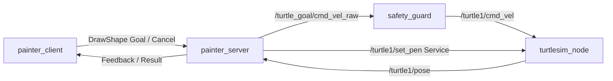

# 第8章案例：TurtlePainter——可反馈、可取消的轨迹绘制

TurtlePainter是TurtleMission贯穿案例的第三个递进版本。它复用第7章TurtleGuard的安全速度通道，将“画一个图形”表达为具有目标、过程反馈、结果和取消能力的长时任务。

## 1. 为什么使用Action

Topic适合连续数据流，Service适合快速完成的请求—响应，而绘图需要持续数秒、不断报告进度，并允许任务中途取消，因此使用动作（Action）。本案例不把每条线段实现为正式状态机，只按有序路径点逐段执行。

本章新增能力：

- 自定义`DrawShape.action`接口；
- Action Client与Action Server的异步交互；
- Goal、Feedback、Result和Cancel；
- 接口生成、CMake和`ament_cmake`功能包；
- 多线程执行器（Multi-Threaded Executor）与回调组入门；
- 取消、位姿失联、线段超时和目标非法时的安全停止。

## 2. 系统结构



Action Server执行路径控制时会持续占用一个回调。位姿订阅、画笔服务响应和取消请求必须仍能得到处理，因此服务器使用两个执行线程：Action使用可重入回调组，使取消回调可以和执行回调并发；位姿订阅与Service Client分别使用互斥回调组。程序再用显式锁限制同一时刻只能接受一个Goal。这是多线程与回调组的最小教学示例，不讨论实时调度。

## 3. 自定义Action接口

文件：`turtle_painter/action/DrawShape.action`

| 部分 | 字段 | 含义 |
|---|---|---|
| Goal | `shape_name` | `square`或`triangle` |
| Goal | `size` | 边长 |
| Goal | `start_x`, `start_y` | 绘图起点 |
| Goal | `speed` | 最大绘图线速度 |
| Feedback | `progress` | 0～1的进度估计 |
| Feedback | `current_segment` | 当前路径段编号，0表示前往起点 |
| Feedback | `remaining_distance` | 估计剩余路径长度 |
| Result | `success` | 是否正常完成 |
| Result | `total_time` | 总执行时间 |
| Result | `position_error` | 结束时的位置误差 |
| Result | `message` | 完成、取消或失败原因 |

服务器先关闭画笔并前往起点，到达后打开画笔，再绘制正方形或等边三角形。因此，进场轨迹不会成为图形的一部分。

## 4. 环境与构建

适用环境：Ubuntu 22.04、ROS 2 Humble、Python 3、turtlesim。代码状态：已完成静态审查，尚待ROS 2 Humble运行验证。

本案例依赖第7章的`turtle_guard`包。将两个包放进同一个工作空间：

```bash
mkdir -p ~/turtle_mission_ws/src
cp -r turtle_guard ~/turtle_mission_ws/src/
cp -r turtle_painter ~/turtle_mission_ws/src/
cd ~/turtle_mission_ws
source /opt/ros/humble/setup.bash
colcon build --symlink-install
source install/setup.bash
```

验证接口是否生成：

```bash
ros2 interface show turtle_painter/action/DrawShape
```

预期结果：终端按Goal、Result和Feedback三部分列出接口字段。若提示接口不存在，检查`CMakeLists.txt`、`package.xml`以及是否重新加载`install/setup.bash`。

## 5. 分终端运行

每个新终端均执行：

```bash
source /opt/ros/humble/setup.bash
source ~/turtle_mission_ws/install/setup.bash
```

终端1启动仿真：

```bash
ros2 run turtlesim turtlesim_node
```

终端2启动第7章安全守卫：

```bash
ros2 run turtle_guard safety_guard --ros-args \
  --params-file ~/turtle_mission_ws/src/turtle_painter/config/turtle_painter.yaml
```

终端3启动Action Server：

```bash
ros2 run turtle_painter painter_server.py --ros-args \
  --params-file ~/turtle_mission_ws/src/turtle_painter/config/turtle_painter.yaml
```

终端4发送默认正方形任务：

```bash
ros2 run turtle_painter painter_client.py --ros-args \
  --params-file ~/turtle_mission_ws/src/turtle_painter/config/turtle_painter.yaml
```

预期现象：海龟无痕移动到`(4.5, 4.5)`，绘制边长2.0的蓝色正方形；客户端持续显示百分比、当前路径段和剩余距离，结束时显示Result。

## 6. 课堂实验

### 实验A：观察Action

```bash
ros2 action list -t
ros2 action info /turtle_painter/draw_shape
```

最低证据：Action名称与类型、一个Action Server，以及运行任务时持续变化的Feedback。

### 实验B：参数化三角形任务

```bash
ros2 run turtle_painter painter_client.py --ros-args \
  -p shape_name:=triangle -p size:=2.5 \
  -p start_x:=4.0 -p start_y:=4.0 -p speed:=1.2
```

预期现象：绘制等边三角形，Result中的`success`为真。若路径顶点超出`[0.5, 10.5]`，服务器拒绝Goal。

### 实验C：反馈与安全取消

设置3秒后由客户端发出取消请求：

```bash
ros2 run turtle_painter painter_client.py --ros-args \
  -p shape_name:=square -p size:=3.0 \
  -p start_x:=3.5 -p start_y:=3.5 \
  -p speed:=0.8 -p cancel_after:=3.0
```

最低成功标准：服务器接受取消；立即向原始速度话题发布零速度；Result说明任务被取消；海龟停止继续绘图。

### 实验D：故障注入

任务执行过程中停止`turtlesim_node`。超过`pose_timeout`后，服务器应中止任务并发布零速度。重新启动仿真不会自动恢复旧任务，需要发送新Goal。

另外可以尝试：

```bash
ros2 run turtle_painter painter_client.py --ros-args \
  -p shape_name:=circle
```

预期结果：Goal被拒绝。当前版本只支持`square`和`triangle`，不接受未实现的图形名称。

## 7. 验收与提交物

基础验收：

- 自定义Action接口能够被ROS 2发现；
- 正方形或三角形能够完成；
- Feedback至少包含进度、路径段和剩余距离；
- 正常完成时返回时间和位置误差；
- 取消后发布零速度并返回明确结果；
- 非法图形、越界路径和失联位姿能够拒绝或中止；
- 安全速度仍经过第7章`safety_guard`。

建议提交：代码、Action接口、运行命令、反馈日志、正常Result、取消Result、一次故障诊断记录，以及Action与Service适用边界的说明。

## 8. 提高任务

1. 增加矩形，但不能改变已有Goal字段，说明如何解释`size`。
2. 用折线逼近圆形，并分析分段数量对误差和反馈频率的影响。
3. 设计“拒绝新Goal”和“新Goal抢占旧Goal”两种策略，本案例只实现前者。
4. 记录取消请求到零速度发布之间的时间，提出可重复的测量方法。

提高任务仍不得引入多乌龟、TF、导航或正式状态机，这些不属于第一册第8章范围。

## 9. ROS1迁移提示

ROS1 Noetic可使用`actionlib`和由`.action`生成的消息实现同一Goal—Feedback—Result模型；构建系统改用catkin。ROS1与ROS2的Action客户端、服务端API和命令不同，不能直接混用。本Demo当前仅提供ROS 2 Humble主实现，ROS1可运行分支仍待编写和验证。

## 10. Technical English

阅读ROS 2官方Interfaces文档，使用以下术语各写一句英文系统描述：`long-running task`、`feedback`、`result`、`cancellation`和`asynchronous`。说明为什么“draw a square”更适合Action而不是Service。

## 11. 文件结构与许可

```text
turtle_painter/
├── action/DrawShape.action
├── config/turtle_painter.yaml
├── scripts/
│   ├── painter_client.py
│   └── painter_server.py
├── CMakeLists.txt
└── package.xml
```

原创代码和配置采用Apache-2.0。README属于教材配套内容，正式入库时按项目许可策略适用CC BY 4.0。当前目录未包含第三方代码、图片、模型或权重。
